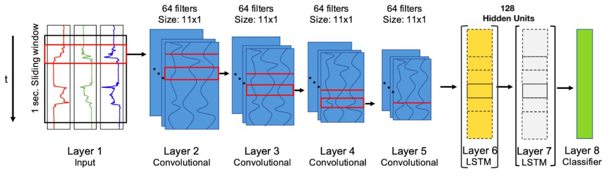
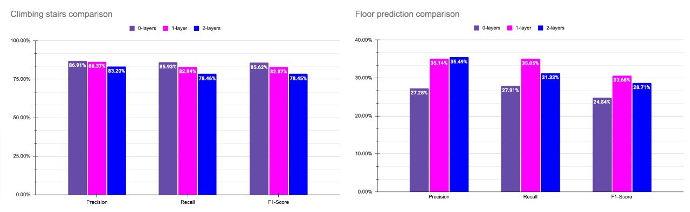

# Understanding Recurrent Neural Networks: Exploring the DeepConvLSTM framework for Human Activity Recognition (HAR)

<b>Project Members:</b><br/>
Andrew Marsh <br/>
Belén Giménez <br/>
Akwasi Gyabaah <br/>
Kaycie Chute <br/>


This is the GitHub page of the repository containing our work project for the Data Science Seminar for the Summer 2022 semester at the University of Siegen. Our work was closely supervised by Marius Bock, and based on his work on Shallow LSTMs [[1]](#1). This repository contains the same code utilised for that work, including specific modifications for our particular needs. The repository our code was based on can be found here: https://github.com/mariusbock/dl-for-har 

The Google Colab notebook in which we ran our experiment by analysing the files of this repository can be found here: https://colab.research.google.com/drive/1ETH8zCtEHfxq0vSN9m7zoXKhjaZkTYEe?usp=sharing 

## Abstract
Deep Learning methods have been increasingly used for the detection and prediction of patterns of human activity, given their ability to outperform previously used methods within the domain of Human Activity Recognition (HAR). DeepConvLSTM is a popular Deep Learning architecture employed for evaluating, analyzing and predicting HAR data. Our work focuses on investigating the necessity and impact of LSTM layers in evaluating a HAR dataset for a case of climbing stairs and another case focused on floor prediction while climbing stairs. We compare the predictive performance of each case by employing three different types of DeepConvLSTM architecture (0-layers, 1-layer, and 2-layers of LSTMs) with the size of 128 hidden units. Results show that across each evaluation case, the 0-layered model had a better predictive performance in the climbing stairs detections, and the 1-layered model had an overall better predictive performance in the floor prediction case. Based on the findings, we also describe the observed limitations and opportunities for future research. With our work, we hope to contribute to the discussion on the utility of the DeepConvLSTM framework, by identifying and understanding the strengths and weaknesses of each architecture.

## Evaluated architecture

We are evaluating the DeepConvLSTM architecture proposed by Ordóñez et al. [[2]](#2) by conducting runs with 0, 1 and 2 LSTMs layers. The architecture is indicated in the graph below, which is a slighlty modified version of the work done by Bock et al.[[1]](#1): 
<p align="center">
  
</p>

## Results
The results were obtained by using a cross-participant cross-validation to evaluate multi-subject data. This type of validation is also known as \emph{Leave-One-Subject-Out (LOSO)}, meaning that each subject was used for the validation set one time, while the data pertaining to the other subjects was used for training, ensuring that the outcomes are not impacted by how each subjects have performed the activities individually (i.e risk of overfitting). 

The results of the climbing stairs and floor predictions were obtained by calculating the average of the 5 runs using 2 layers, 1 layer, or no layers of LSTMs within a DeepConv architecture of 128 hidden units, used to also avoid the risk of overfitting within our small dataset. 


### Overall results
The figure below shows the averages of precision, recall, and F1-score metrics of both climbing stairs, and floor predictions:
<p align="center">
  
</p>


## Repo Structure
- logs_har2022: folder containing all the log files of the conducted runs for the different evaluation cases
- data_processing: contains file for data processing (analysis, creation, preprocessing and sliding window approach)
- model: folder containing the DeepConvLSTM model, train and evaluation script
- main.py: main script which is to be run in order to commence experiments. This script will be overrun by the last script in the Google Colab file
- Results.xlsx: an excel sheet file with the results presented 
- Images: folder containing the graphs used to show the results of the runs, as well as the graph of the DeepConvLSTM model

## Installing requirements

Given that we ran our code through Google Colab, local installations were not necessary. However, if you wish to run the code locally, you can take a look at the required packages in the ```requirements.txt``` file. For more instalation details to run the experiments locally, you can visit https://github.com/mariusbock/dl-for-har 


### Dataset
The dataset used is titled ```stairs_data.csv``` and it can be found on the data folder within this repository.


## (Re-)running experiments

To run experiments one can modify make a copy of the Google Colab file shared above and modify the settings within the last script in that document. It is important to follow the initial instructions to upload the github repository first, to access the files to run the code and perform the runs successfully.  

## Log files

The log files of our runs is available in the folder ```logs_har2022``` folder within this repository. Each run has its respective folder within it, to denote the number of seeds and LSTMs used.

## Results 

Our results are available in the ```Results.xlsx sheet```. In there the percentages of precision, recall and F1-score are delineated for every evaluation case, as well as the respective standard deviations (across runs, per-class results, and acrosss subjects) and the averages that are shown in the graphs. 

## References
<a id="1">[1]</a> Marius Bock, Alexander Hölzemann, Michael Moeller, and Kristof Van Laerhoven. 2021. Improving Deep Learning for HAR with shallow LSTMs. In 2021 International Symposium on Wearable Computers (ISWC ’21), September 21–26, 2021, Virtual, USA. ACM, New York, NY, USA, 6 pages. https://doi.org/10.1145/3460421.3480419 

<a id="2">[2]</a> Ordóñez, F. J., & Roggen, D. (2016). Deep convolutional and lstm recurrent neural networks for multimodal wearable activity recognition. Sensors, 16(1), 115.

